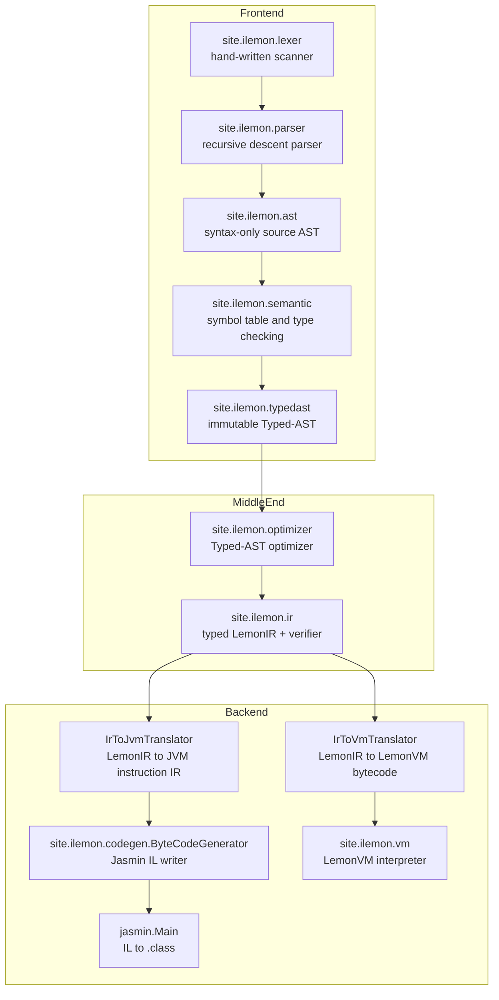
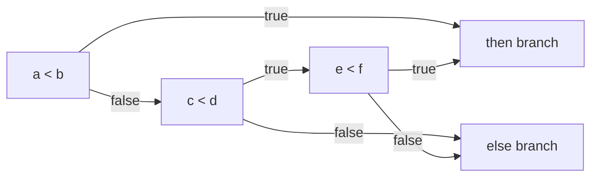
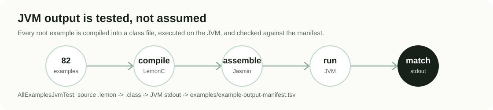

# LemonC

[](https://github.com/yananlemon/LemonC/actions/workflows/ci.yml)

**LemonC is a teaching-oriented C-like compiler written in Java.**

It compiles Lemon source code through lexical analysis, recursive descent parsing, Typed-AST construction and optimization, typed LemonIR, and dual backends for JVM bytecode and LemonVM execution.

LemonC 是一个面向编译原理教学与实践的小型 C-like 编译器。它不是只停留在 AST 或三地址码展示层，而是把 `.lemon` 源程序降低到类型化 LemonIR，再分别生成 JVM 字节码或 LemonVM 字节码，并用双后端输出一致性做端到端回归验证。

```text
Java 8+ | Maven | LemonIR | JVM + LemonVM | 349 tests passing | 86 examples | Apache-2.0
```

## Why LemonC

| What you get | Why it matters |
|---|---|
| Complete compiler pipeline | Lexer, parser, semantic analyzer, Typed-AST optimizer, LemonIR, JVM backend, LemonVM backend |
| Real backend execution | Examples compile to `.class` for JVM and to LemonVM bytecode for the custom VM |
| Classic compiler theory | Recursive descent parsing, syntax-to-Typed-AST analysis, backpatching, stack-machine codegen |
| Teaching-friendly visibility | CLI can dump tokens, Typed-AST, LemonIR, and LemonVM bytecode |
| Regression confidence | 86 example programs are checked against real JVM and LemonVM stdout |
| Small enough to read | A compact codebase for students who want to understand a whole compiler |

## At A Glance

The whole project is intentionally small enough to read, but complete enough to demonstrate a real compiler pipeline from source code to typed IR, JVM execution, and custom VM execution.

## 30-Second Demo

Source: [examples/OptimizationTest.lemon](examples/OptimizationTest.lemon)

```c
class OptimizationTest {
    void main() {
        int a;
        int b;
        bool c;
        a = (2 + 3) * 4;
        b = (a * 1) + 0;
        c = (1 < 2) && true;
        if (c) {
            printf("a=%d,b=%d\n", a, b);
        } else {
            printf("bad\n");
        }
        while (false) {
            printf("dead\n");
        }
    }
}
```

Compile, inspect, and run:

```bash
mvn clean package

java -jar target/LemonC-0.1-beta-jar-with-dependencies.jar \
  examples/OptimizationTest.lemon --dump-tokens --dump-ast --dump-ir

java -cp target/lemonc OptimizationTest
```

Real JVM output:

```text
a=20,b=20
```

The same example also demonstrates constant folding, algebraic simplification, boolean folding, dead `while(false)` removal, and the CLI inspection pipeline.

## What Lemon Supports

| Category | Features |
|---|---|
| Types | `int`, `float`, `double`, `bool`, `void` |
| Arrays | `int[]`, `float[]`, `double[]`, `bool[]`, array parameters, indexed access/assignment, `.length` |
| Arithmetic | `+`, `-`, `*`, `/`, `%`, unary `-` |
| Assignment | `=`, compound `+=`, `-=`, `*=`, `/=`, `%=`, postfix `++`, `--` (statement form) |
| Numeric widening | `int -> float`, `int -> double`, `float -> double` |
| Comparison | `>`, `<`, `>=`, `<=`, `==`, `!=` |
| Boolean logic | `true`, `false`, `!`, `&&`, `||`, short-circuit control flow |
| Control flow | `if/else`, `while`, `for`, `break`, `continue`, nested loops |
| Methods | parameters, return values, `void` methods, recursive calls, expression calls |
| Output | `printf`, `printLine`, `%d`, `%f`, `\n`, `\t` |
| Optimization | constant folding, boolean folding, algebraic simplification, constant branch simplification |
| Diagnostics | end-exclusive source spans from tokens through LemonIR, plus structured compiler error types |

For the complete feature list with source code and real outputs, read [docs/LEMONC_FEATURES.md](docs/LEMONC_FEATURES.md).

## Compiler Architecture



| Module | Core classes | Responsibility |
|---|---|---|
| `site.ilemon.lexer` | `Lexer`, `Token`, `TokenKind` | Tokenize Lemon source code |
| `site.ilemon.parser` | `Parser` | Build frontend AST with recursive descent parsing |
| `site.ilemon.ast` | `Ast` | Define syntax-only source expressions, statements, declarations, and programs |
| `site.ilemon.semantic` | `SemanticVisitor`, `SemanticResult` | Resolve symbols and types while transforming source AST into Typed-AST |
| `site.ilemon.typedast` | `TypedAst` | Define immutable typed nodes, resolved symbols, and semantic `ErrorType` |
| `site.ilemon.optimizer` | `AstOptimizer` | Perform safe Typed-AST simplifications |
| `site.ilemon.ir` | `AstToIrTranslator`, `IrVerifier`, `IrToJvmTranslator`, `IrToVmTranslator` | Define typed LemonIR and lower it to JVM or LemonVM backends |
| `site.ilemon.codegen` | `ByteCodeGenerator`, `TranslatorVisitor` | Write Jasmin assembly; `TranslatorVisitor` is the older direct AST-to-JVM path kept for tests/reference |
| `site.ilemon.codegen.ast` | `Ast`, `Label` | Define backend JVM instruction-level IR |
| `site.ilemon.vm` | `LemonVm`, `VmBytecodeParser`, `RuntimeStack`, `Value` | Execute LemonVM bytecode |
| `site.ilemon.compiler` | `LemonC`, `AstPrinter`, `IrPrinter` | CLI entrypoint and teaching-friendly dumps |

For the current implementation boundaries, read [docs/ARCHITECTURE.md](docs/ARCHITECTURE.md).
The [documentation index](docs/DOCUMENTATION_INDEX.md) distinguishes current references from
historical review snapshots and design proposals.

## Backpatching In Action

The legacy direct JVM translator uses classic backpatching for boolean expressions and flow-control statements. The current LemonIR pipeline represents short-circuit boolean logic as explicit control-flow blocks before lowering to each backend.

For:

```c
if (a < b || c < d && e < f) {
    printf("yes\n");
} else {
    printf("no\n");
}
```

The conceptual control-flow shape is:



The implementation follows the textbook rules:

```text
E1 || E2:
  backpatch(E1.falseList, E2.entry)
  E.trueList  = merge(E1.trueList, E2.trueList)
  E.falseList = E2.falseList

E1 && E2:
  backpatch(E1.trueList, E2.entry)
  E.trueList  = E2.trueList
  E.falseList = merge(E1.falseList, E2.falseList)
```

This makes the project useful for students studying syntax-directed translation and control-flow generation.

## Backend Output Is Tested, Not Assumed

Every root example under [examples](examples) is compiled and executed by [AllExamplesJvmTest.java](src/test/java/AllExamplesJvmTest.java) and [AllExamplesVmTest.java](src/test/java/AllExamplesVmTest.java). Additional equivalence tests compare JVM and LemonVM output through the shared LemonIR pipeline.

<p align="center">
  
</p>

Run the suite:

```bash
mvn clean test
```

Current coverage:

```text
Tests run: 349, Failures: 0, Errors: 0, Skipped: 0
86 root examples verified by real JVM execution and LemonVM execution
```

## More Real Examples

### Numeric Widening, for, break, continue, arrays

Source: [examples/LanguageFeatureTest.lemon](examples/LanguageFeatureTest.lemon)

```text
sum=8
neg=-8
f=3.5,d=4.5
call=3.0,7.0
arr=2
```

### Nested loops

Source: [examples/NestedLoops.lemon](examples/NestedLoops.lemon)

```text
  inner run i=1, j=1
  inner break on 2
outer continue skip 2
  inner run i=3, j=1
  inner break on 2
```

### Floating-point NaN comparison

Source: [examples/NaNCompareTest.lemon](examples/NaNCompareTest.lemon)

```text
flt_lt=0
flt_lte=0
flt_gt=0
flt_gte=0
flt_eq=0
flt_neq=1
dbl_lt=0
dbl_lte=0
dbl_gt=0
dbl_gte=0
dbl_eq=0
dbl_neq=1
```

### Recursive Fibonacci

Source: [examples/Fib.lemon](examples/Fib.lemon)

```text
递归计算斐波那契数列，一年后总共有144对兔子
循环计算斐波那契数列，一年后总共有144对兔子
```

## Quick Start

Requirements:

```text
JDK 1.8+
Maven 3.3+
```

Build directly. The Jasmin dependency is resolved from the project-local Maven repository under `jars/maven-repo`.

```bash
mvn clean package
```

Compile and run a Lemon program:

```bash
java -jar target/LemonC-0.1-beta-jar-with-dependencies.jar examples/Fib.lemon
java -cp target/lemonc Fib
```

Inspect compiler stages:

```bash
java -jar target/LemonC-0.1-beta-jar-with-dependencies.jar \
  examples/ModTest.lemon --dump-tokens --dump-ast --dump-ir
```

### LemonVM resource limits

LemonVM bounds runaway programs so they fail instead of hanging. Neither limit is part of
the language semantics — the JVM backend has no counterpart — and both are adjustable:

| Flag | Default | Purpose |
|---|---|---|
| `--vm-instruction-limit N` | `100000000` (~2s); `0` disables | Turns an infinite loop into a fast, located failure |
| `--vm-stack-size N` | `1048576` slots | Bounds runaway recursion; the stack grows on demand from 4096 slots |

Strict backend equivalence on arbitrarily long programs requires `--vm-instruction-limit 0`.

Runtime faults report the source location and preserve output produced before the fault:

```text
runtime error: 行 7, 列 24（指令 Div，PC=3）: 除零错误
```

## Lemon Language In One Page

```c
class Demo {
    int fib(int n) {
        int result;
        if (n < 3) {
            result = 1;
        } else {
            result = fib(n - 1) + fib(n - 2);
        }
        return result;
    }

    void main() {
        int i;
        int sum;
        int arr[3];
        sum = 0;

        for (i = 0; i < 3; i = i + 1) {
            arr[i] = i + 1;
            sum = sum + arr[i];
        }

        if (sum == 6 && fib(6) == 8) {
            printf("ok=%d\n", sum);
        } else {
            printf("bad\n");
        }
    }
}
```

## Grammar Snapshot

```bnf
<program>       ::= "class" <id> "{" <method>* "}"
<method>        ::= <returnType> <name> "(" <params>? ")" "{" <blockItem>* "}"
<returnType>    ::= <type> | "void"
<params>        ::= <param> ("," <param>)*
<param>         ::= <type> <id> ("[" "]")?
<blockItem>     ::= <varDecl> | <stmt>
<varDecl>       ::= <type> <id> ("=" <expr> | "[" <integer> "]")? ";"
<type>          ::= "int" | "float" | "double" | "bool"
<stmt>          ::= <id> "=" <expr> ";"
                  | <id> "[" <expr> "]" "=" <expr> ";"
                  | <id> "(" <args>? ")" ";"
                  | "if" "(" <expr> ")" <stmt> ("else" <stmt>)?
                  | "while" "(" <expr> ")" <stmt>
                  | "for" "(" <forClause>? ";" <expr>? ";" <forClause>? ")" <stmt>
                  | "break" ";"
                  | "continue" ";"
                  | "{" <blockItem>* "}"
                  | "return" <expr>? ";"
                  | "printf" "(" <string> ("," <expr>)* ")" ";"
                  | "printLine" "(" ")" ";"
<expr>          ::= <andExpr> ("||" <andExpr>)*
<andExpr>       ::= <relExpr> ("&&" <relExpr>)*
<relExpr>       ::= <addExpr> ((">" | "<" | ">=" | "<=" | "==" | "!=") <addExpr>)*
<addExpr>       ::= <term> (("+" | "-") <term>)*
<term>          ::= <factor> (("*" | "/" | "%") <factor>)*
<forClause>     ::= <id> "=" <expr>
                  | <id> "[" <expr> "]" "=" <expr>
                  | <id> "(" <args>? ")"
```

## Test Suite

| Test class | Count | Purpose |
|---|---:|---|
| `AllExamplesJvmTest` | 1 | Compile every root example to `.class`, run JVM, compare stdout |
| `AllExamplesVmTest` | 1 | Compile every root example to LemonVM bytecode, run LemonVM, compare stdout |
| `AstOptimizerTest` | 10 | Verify Typed-AST optimization behavior |
| `AstToIrTranslatorTest` | 1 | Reject unresolved symbols at the Typed-AST/IR boundary |
| `BackendEquivalenceTest` | 6 | Compare JVM and LemonVM outputs through the shared LemonIR path |
| `ByteCodeGeneratorTest` | 13 | Verify JVM bytecode and stack/local metadata |
| `CompilerTest` | 72 | End-to-end compiler tests |
| `DiagnosticTest` | 33 | Verify source diagnostics and CLI behavior |
| `DualBackendConsistencyTest` | 7 | Check selected examples on the LemonVM path |
| `ErrorTest` | 48 | Negative parse and semantic tests |
| `IrToVmTranslatorTest` | 2 | Verify IR-to-VM lowering |
| `IrVerifierTest` | 8 | Verify LemonIR structural and type checks |
| `LemonVmCliTest` | 4 | Verify LemonVM CLI behavior |
| `LemonVmTest` | 25 | Verify LemonVM runtime semantics |
| `LexerRegressionTest` | 6 | Ensure robust fallback edge cases in Lexer |
| `LexerTest` | 18 | Lexer tests |
| `LocalDeclarationTest` | 5 | Variable scoping tests |
| `ParseRecoveryTest` | 4 | Resilient parse failure behavior |
| `ParserRobustnessTest` | 5 | Unusual syntax checks |
| `ParserTest` | 18 | Parser tests |
| `ReturnStatementTest` | 3 | Semantic return-path analysis |
| `SemanticTest` | 1 | Semantic visitor smoke test |
| `SourceSpanPropagationTest` | 3 | Verify token, Source AST, Typed-AST, optimizer, and LemonIR ranges |
| `TranslatorVisitorTest` | 14 | Legacy direct JVM instruction translation tests |
| `TypedAstSeparationTest` | 3 | Enforce source/typed tree separation and semantic ErrorType ownership |

## Repository Map

```text
src/main/java/site/ilemon
  ast/              syntax-only source AST
  typedast/         immutable Typed-AST and resolved symbols
  lexer/            tokenization
  parser/           recursive descent parser
  semantic/         source-to-Typed-AST analysis and diagnostics
  source/           immutable end-exclusive SourceSpan
  optimizer/        Typed-AST optimization
  ir/               typed LemonIR, verifier, JVM/VM lowering
  codegen/          JVM instruction IR and Jasmin generation
  vm/               LemonVM runtime and bytecode parser
  compiler/         CLI, AST printer, IR printer

examples/           85 Lemon programs and output manifest
docs/               architecture, feature guide, and review notes
tools/              native backend experiment, kept outside main source
src/test/java/      automated compiler tests
```

## Current Language Boundaries

LemonC intentionally keeps the language small:

| Boundary | Status |
|---|---|
| Identifier `_` | Supported in identifiers and class names |
| Multi-line comments | Supported with `/* ... */` |
| Local declarations | Supported at any block-item position, with optional scalar initializer |
| Block scope | Blocks introduce visibility scopes; redeclaring a name anywhere in the same method is rejected |
| Empty return | `return;` is supported in `void` methods |
| String variables | Strings are primarily `printf` literals |
| Object model | Single-class teaching language, not full Java |

## Roadmap

The codebase now has enough substance for a serious teaching compiler. The next milestones are:

1. Keep the existing GitHub Actions build green.
2. Publish `v0.2.0` with a ready-to-run jar.
3. Add an English tutorial: "Build a JVM compiler from scratch with LemonC".
4. Add visual snapshots of token, Typed-AST, and IR dumps.
5. Add CFG/data-flow optimization as the next advanced chapter.
6. Add GitHub topics: `compiler`, `compiler-design`, `jvm`, `bytecode`, `parser`, `semantic-analysis`, `backpatching`, `teaching`.

## License

LemonC is released under the [Apache License 2.0](LICENSE).
